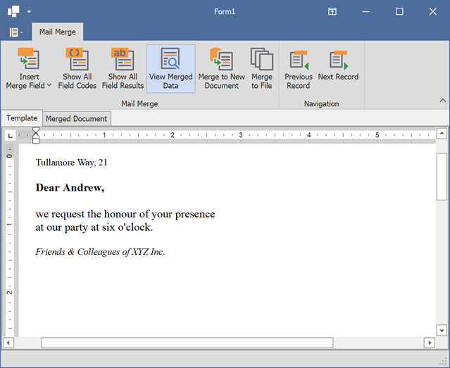

<!-- default badges list -->

<!-- default badges end -->
# How to Implement Mail Merge in a RichEditControl

This example illustrates how to implement mail merge in the [RichEditControl](https://docs.devexpress.com/WindowsForms/DevExpress.XtraRichEdit.RichEditControl).

In this example, the **ArrayList** generated at runtime is used as a data source that supplies mail merge data to the document. The tab control on the form contains a Ribbon UI and two **RichEditControl** instances (one of them is used to construct a document template, and the other displays the mail merge result). The [RichEditMailMergeOptions.ActiveRecord](https://docs.devexpress.com/OfficeFileAPI/DevExpress.XtraRichEdit.RichEditMailMergeOptions.ActiveRecord) property is used to navigate between records.

## Files to Review

* [Form1.cs](./CS/MailMerge/Form1.cs) (VB: [Form1.vb](./VB/MailMerge/Form1.vb))
* [SampleData.cs](./CS/MailMerge/SampleData.cs) (VB: [SampleData.vb](./VB/MailMerge/SampleData.vb))

## More Examples

* [How to export the RichEditControl document into an Outlook mail item](https://github.com/DevExpress-Examples/how-to-export-the-richeditcontrol-document-into-an-outlook-mail-item-e4438)

## Documentation

* [Mail Merge in Rich Text Documents](https://docs.devexpress.com/WindowsForms/9330/controls-and-libraries/rich-text-editor/mail-merge)
* [How to: Send the Mail-Merge Document as an E-Mail](https://docs.devexpress.com/WindowsForms/120456/controls-and-libraries/rich-text-editor/examples/import-and-export/how-to-send-the-mail-merge-document-as-an-e-mail)
